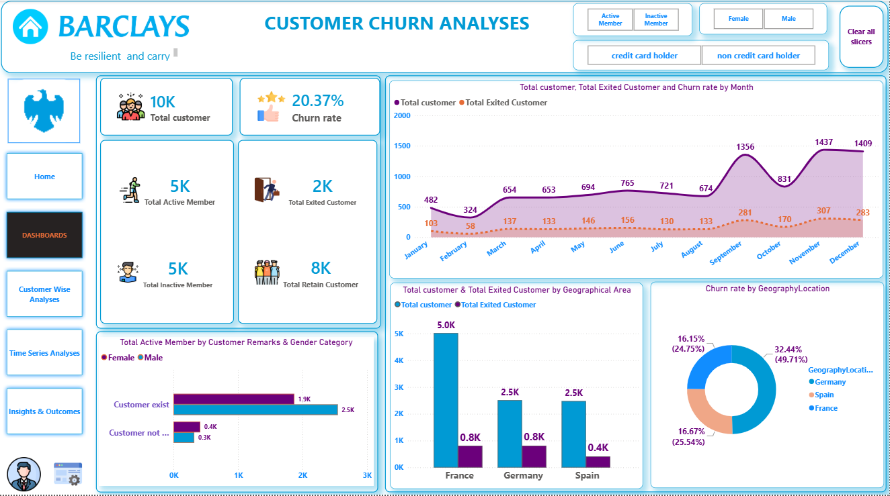

# 📊 Barclays Bank Customer Churn Analysis Dashboard

## 📌 Project Overview

This project analyzes customer churn at Barclays Bank using Power BI.

The dashboard provides interactive insights into customer demographics, account activity, credit score, balance, product ownership, and churn behavior to help improve customer retention strategies.

---

## 🎯 Business Objectives

- Analyze customer churn rate
- Identify high-risk customers
- Understand churn behavior
- Improve customer retention
- Support business decision making

---

## 🛠️ Tools & Technologies

- Power BI
- Power Query
- DAX
- Microsoft Excel
- Data Modeling

---

## 📈 Key Performance Indicators (KPIs)

- Total Customers
- Active Customers
- Exited Customers
- Churn Rate
- Average Balance
- Average Credit Score
- Average Salary
- Average Products
- Average Tenure

---

## 📊 Dashboard Features

- Executive Dashboard
- Customer Analysis
- Geography Analysis
- Time Series Analysis
- Customer Segmentation
- Interactive Filters
- Business Insights

---

## 💡 Business Insights

- Low engagement customers have a higher churn rate.
- Credit score impacts customer retention.
- Geography influences churn behavior.
- Product ownership increases customer loyalty.
- Customer age and tenure affect churn probability.

---

## 📷 Dashboard Preview

---

## 📂 Project Structure

    Barclays-Bank-Customer-Churn-Analysis
    │
    ├── README.md
    ├── Dashboard.pbix
    ├── Dashboard.pdf
    ├── Images
    │   └── Dashboard.png
    
    

## 🚀 Skills Demonstrated

- Data Cleaning
- Data Transformation
- Data Modeling
- DAX
- Power Query
- Data Visualization
- Business Intelligence
- Dashboard Design
- Data Storytelling

---

## 📬 Contact

**Praveen Rawat**

LinkedIn: https://www.linkedin.com/in/praveen-rawat-data/

GitHub: https://github.com/praveenrawat12

Email: praveen.rawat3705@email.com
